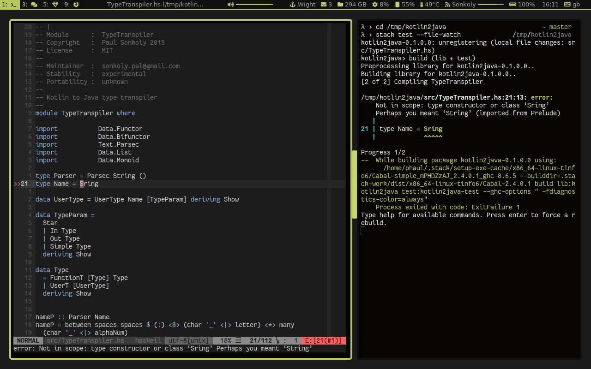
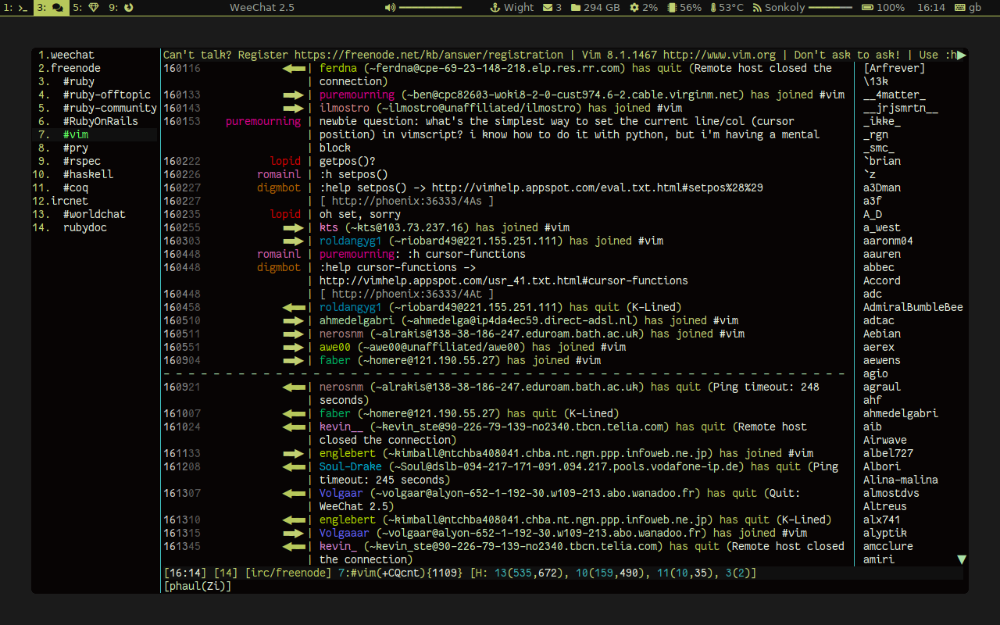

DOTFILES
========

This repository contains the personal configuration files I use on my \*nix
systems. The configuration files include setup for the following programs:

 * zsh
 * compton
 * dunst
 * fzf
 * gtk-3
 * i3-gaps
 * polybar
 * pywal
 * rubocop
 * termite
 * neovim
 * xinit

There are custom scripts under bin/ which require a working ruby environment.
Some setup is related to arch-linux and the yay package manager.

Screenshots
===========

These screenshots were taken in Jul/2019 and since then the look of the setup
has changed slightly. If you are after re-creating the looks on the screenshot
probably you should check out the commit that has the shots posted. (021715c2)

Fake busy:

Weechat:

Empty, with dunst notification:

Wallpaper
=========

[link](http://simpledesktops.com/browse/desktops/2016/oct/12/hydrogen-remixed/)

