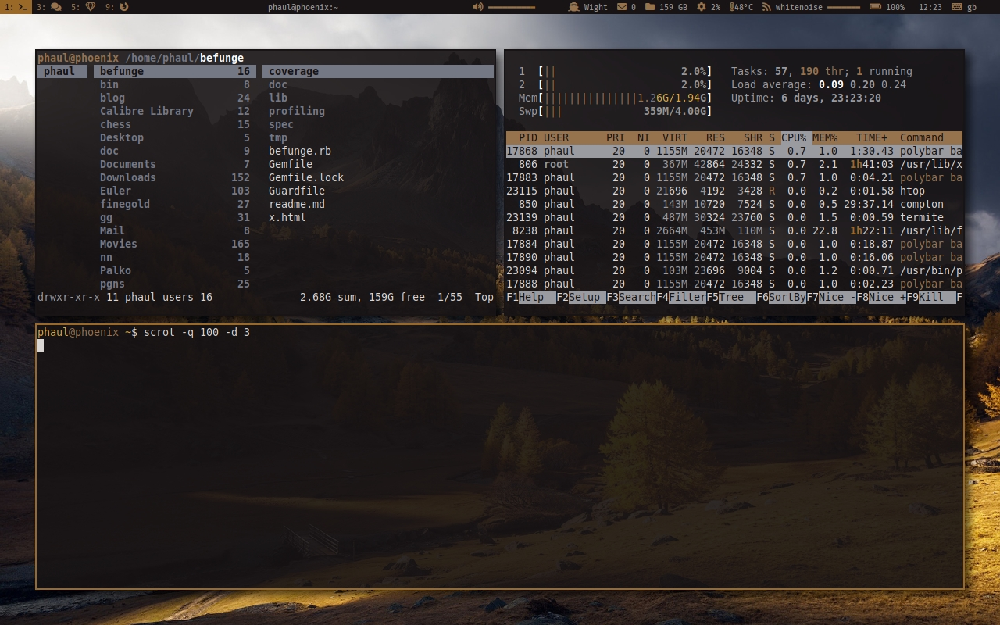

DOTFILES
========

This repository contains the personal configuration files I use on my \*nix
systems. The configuration files include setup for the following programs:

 * bash
 * compton
 * dunst
 * fzf
 * gtk-3
 * i3-gaps
 * polybar
 * pywal
 * rubocop
 * termite
 * vim
 * xinit

There are custom scripts under bin/ which require a working ruby environment.
Some setup is related to arch-linux and the yay package manager.

Screenshots
===========

Empty, with dunst notification:

Fake busy:

Wallpaper
=========

[link](https://alpha.wallhaven.cc/wallpaper/623995)

