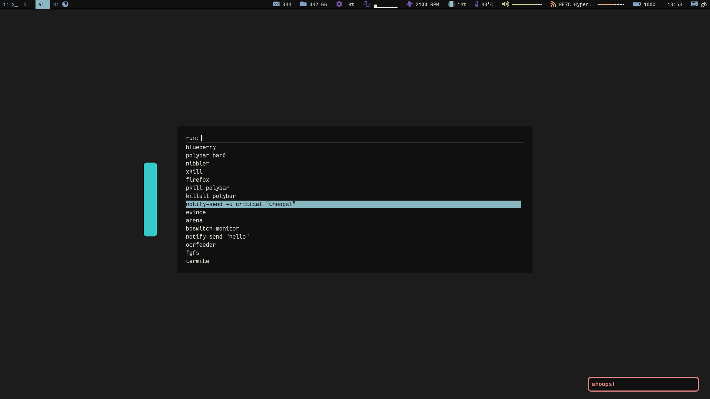
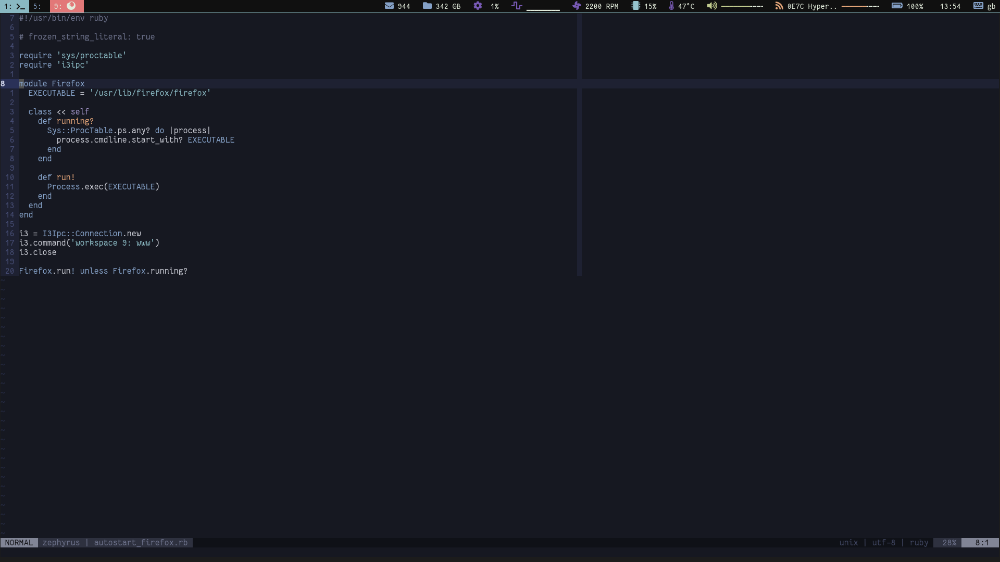
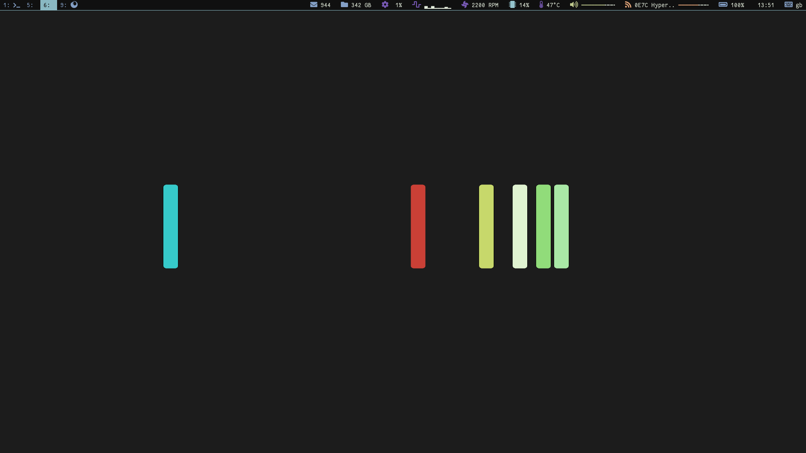

DOTFILES
========

This repository contains the personal configuration files I use on my \*nix
systems. The configuration files include setup for the following programs:

 * zsh
 * dunst
 * fzf
 * gtk-3
 * i3-gaps
 * polybar
 * rubocop
 * termite
 * neovim
 * xinit

The config structure received an overhaul whereby all config is generated from
a single source. This is similar to how pywal would generate color scheme for
all programs, but tailoring pywal output requires per program fiddling. Ie some
programs can read xresouorces, some can read environment variables, some work
with command line argument.

This motivated [this](http://github.com/phaul/configs) ruby gem, that manages
my dotfiles now.

There are custom scripts under bin/ which require a working ruby environment.
Some setup is related to arch-linux and the yay package manager.

Screenshots
===========

These screenshots were taken in Jul/2019 and since then the look of the setup
has changed slightly. If you are after re-creating the looks on the screenshot
probably you should check out the commit that has the shots posted. (021715c2)

Rofi / dunst:

vim:

Empty:

Wallpaper
=========

[link](http://simpledesktops.com/browse/desktops/2016/oct/12/hydrogen-remixed/)

